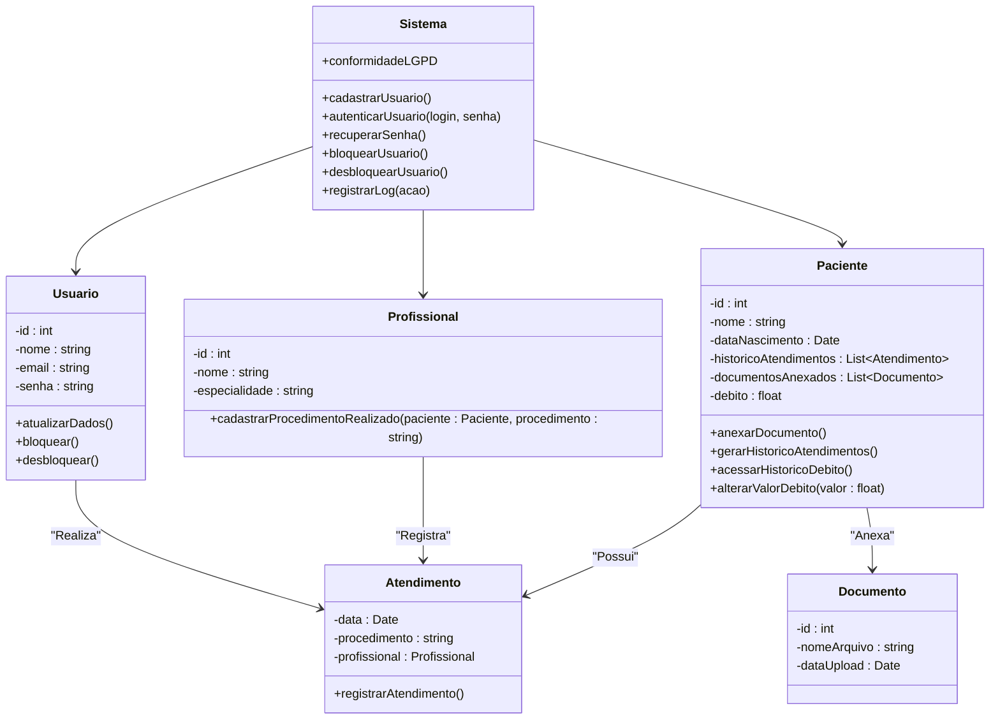

# Gestão de débitos e procedimentos
ENGENHARIA DE SOFTWARE 

- [Gestão de débitos e procedimentos](#gestão-de-débitos-e-procedimentos)
  - [1. Introdução](#1-introdução)
  - [2. Descrição](#2-descrição)
    - [2.1. Requisitos](#21-requisitos)
    - [2.2. Funcionais e não funcionais](#22-funcionais-e-não-funcionais)
  - [3. Diagramas](#3-diagramas)
    - [3.1. Diagrama de classes](#31-diagrama-de-classes)
      - [Digrama no Whitestar](#digrama-no-whitestar)
      - [Diagrama gerado por IA](#diagrama-gerado-por-ia)
    - [3.2. Diagramas de classes de uso](#32-diagramas-de-classes-de-uso)
    - [3.3. diagrama de atividade](#33-diagrama-de-atividade)
    - [3.4. diagrama de componentes](#34-diagrama-de-componentes)
    - [3.5. diagrama implantação](#35-diagrama-implantação)
  - [4. Hitórias de usuário](#4-hitórias-de-usuário)
  - [5. Protótipo de telas](#5-protótipo-de-telas)
  - [6. Diagrama de navegação de telas](#6-diagrama-de-navegação-de-telas)

## 1. Introdução

Software para gerenciar débitos e procedimentos de clientes em uma clínica odontológica/estética.

## 2. Descrição

### 2.1. Requisitos

|id|Requisitos        |
|--|----------        |
|1| O sistema deve permitir cadastro de usuários
|2| Deve haver autenticação com login e senha
|3| Possibilitar recuperação de senha
|4| Permitir bloqueio e desbloqueio de usuários
|5| Registrar log de todas as ações dos usuários
|6| Cadastrar pacientes com informações completas
|7| Permitir atualização de dados cadastrais
|8| Gerar histórico de atendimentos e débitos
|9| Possibilitar anexar documentos ao cadastro
|10| Implementar busca e filtros de pacientes
|11| Alteração do valor do débito
|12| Conformidade com LGPD
|13| Registrar todas as transações
|14| Interface intuitiva e responsiva
|15| Relatório de procedimentos realizados
|16| Acessar o hitórico de débito e procedimentos de um cliente
|17| Vincular com o profissional o precedimentos feito pelo cliente
|18| Cadastrar profissionais

### 2.2. Funcionais e não funcionais

> [!Tip] 
> Faça uma tabela usando Markdown com duas colunas, uma coluna indicando o requisito e a outra coluna indicando o tipo de requisito ( como "funcional" ou "não funcional" ), para esta tarefa use a lista abaixo:

| Requisito                                                | Tipo de Requisito  |
|----------------------------------------------------------|--------------------|
| O sistema deve permitir cadastro de usuários              | Funcional          |
| Deve haver autenticação com login e senha                 | Funcional          |
| Possibilitar recuperação de senha                         | Funcional          |
| Permitir bloqueio e desbloqueio de usuários               | Funcional          |
| Registrar log de todas as ações dos usuários              | Funcional          |
| Cadastrar pacientes com informações completas             | Funcional          |
| Permitir atualização de dados cadastrais                  | Funcional          |
| Gerar histórico de atendimentos e débitos                 | Funcional          |
| Possibilitar anexar documentos ao cadastro                | Funcional          |
| Implementar busca e filtros de pacientes                  | Funcional          |
| Alteração do valor do débito                              | Funcional          |
| Conformidade com LGPD                                     | Não Funcional      |
| Registrar todas as transações                             | Funcional          |
| Interface intuitiva e responsiva                          | Não Funcional      |
| Relatório de procedimentos realizados                     | Funcional          |
| Acessar o histórico de débito e procedimentos de um cliente| Funcional          |
| Vincular com o profissional o procedimento feito pelo cliente | Funcional       |
| Cadastrar profissionais                                   | Funcional          |
| Banco de dados postgree                                   | Não funcional      |
| Design Responsivo                                         | Não funcional      |  

## 3. Diagramas

### 3.1. Diagrama de classes

#### Digrama no Whitestar

#### Diagrama gerado por IA

> [!tip]
> Faça um diagrama de classe usando Markdown e Mermaid, para os requisitos abaixo:

### 3.2. Diagramas de classes de uso

### 3.3. diagrama de atividade

### 3.4. diagrama de componentes

### 3.5. diagrama implantação

## 4. Hitórias de usuário

## 5. Protótipo de telas

## 6. Diagrama de navegação de telas