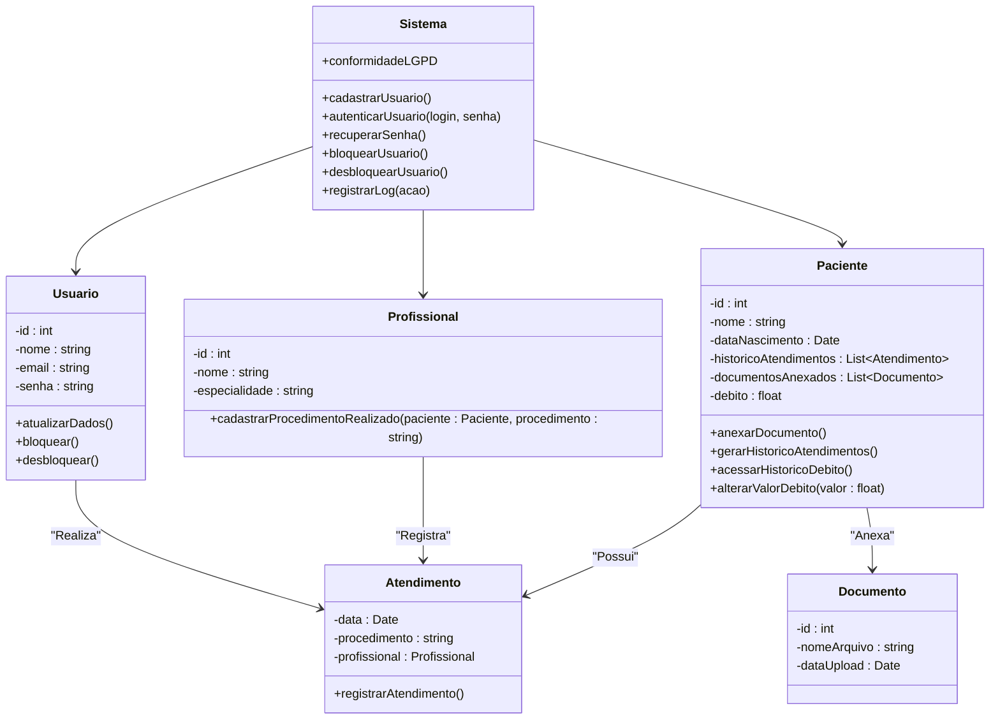
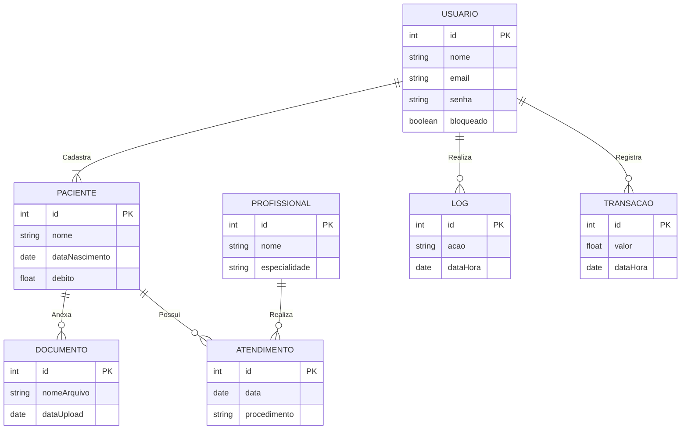

# Gestão de débitos e procedimentos
ENGENHARIA DE SOFTWARE 

- [Gestão de débitos e procedimentos](#gestão-de-débitos-e-procedimentos)
  - [1. Introdução](#1-introdução)
  - [2. Descrição](#2-descrição)
    - [2.1. Requisitos](#21-requisitos)
    - [2.2. Funcionais e não funcionais](#22-funcionais-e-não-funcionais)
  - [3. Diagramas](#3-diagramas)
    - [3.1. Diagrama de classes](#31-diagrama-de-classes)
      - [Digrama no Whitestar](#digrama-no-whitestar)
      - [Diagrama gerado por IA](#diagrama-gerado-por-ia)
      - [Explicação:](#explicação)
    - [3.2. Diagrama ER](#32-diagrama-er)
      - [Explicação das Entidades e Relacionamentos:](#explicação-das-entidades-e-relacionamentos)
    - [3.2. Diagramas de classes de uso](#32-diagramas-de-classes-de-uso)
    - [3.3. diagrama de atividade \*\*\*](#33-diagrama-de-atividade-)
    - [3.4. diagrama de componentes](#34-diagrama-de-componentes)
    - [3.5. diagrama implantação](#35-diagrama-implantação)
  - [4. Hitórias de usuário](#4-hitórias-de-usuário)
  - [5. Protótipo de telas](#5-protótipo-de-telas)
  - [6. Diagrama de navegação de telas](#6-diagrama-de-navegação-de-telas)
  - [Anexos](#anexos)
    - [A.1. Script SQL](#a1-script-sql)
    - [A.2. Dados artificiais para testes de banco](#a2-dados-artificiais-para-testes-de-banco)


## 1. Introdução

Software para gerenciar débitos e procedimentos de clientes em uma clínica odontológica/estética.

## 2. Descrição

### 2.1. Requisitos

|id|Requisitos        |
|--|----------        |
|1| O sistema deve permitir cadastro de usuários
|2| Deve haver autenticação com login e senha
|3| Possibilitar recuperação de senha
|4| Permitir bloqueio e desbloqueio de usuários
|5| Registrar log de todas as ações dos usuários
|6| Cadastrar pacientes com informações completas
|7| Permitir atualização de dados cadastrais
|8| Gerar histórico de atendimentos e débitos
|9| Possibilitar anexar documentos ao cadastro
|10| Implementar busca e filtros de pacientes
|11| Alteração do valor do débito
|12| Conformidade com LGPD
|13| Registrar todas as transações
|14| Interface intuitiva e responsiva
|15| Relatório de procedimentos realizados
|16| Acessar o hitórico de débito e procedimentos de um cliente
|17| Vincular com o profissional o precedimentos feito pelo cliente
|18| Cadastrar profissionais

### 2.2. Funcionais e não funcionais

> [!Tip] 
> Faça uma tabela usando Markdown com duas colunas, uma coluna indicando o requisito e a outra coluna indicando o tipo de requisito ( como "funcional" ou "não funcional" ), para esta tarefa use a lista abaixo:

| Requisito                                                | Tipo de Requisito  |
|----------------------------------------------------------|--------------------|
| O sistema deve permitir cadastro de usuários              | Funcional          |
| Deve haver autenticação com login e senha                 | Funcional          |
| Possibilitar recuperação de senha                         | Funcional          |
| Permitir bloqueio e desbloqueio de usuários               | Funcional          |
| Registrar log de todas as ações dos usuários              | Funcional          |
| Cadastrar pacientes com informações completas             | Funcional          |
| Permitir atualização de dados cadastrais                  | Funcional          |
| Gerar histórico de atendimentos e débitos                 | Funcional          |
| Possibilitar anexar documentos ao cadastro                | Funcional          |
| Implementar busca e filtros de pacientes                  | Funcional          |
| Alteração do valor do débito                              | Funcional          |
| Conformidade com LGPD                                     | Não Funcional      |
| Registrar todas as transações                             | Funcional          |
| Interface intuitiva e responsiva                          | Não Funcional      |
| Relatório de procedimentos realizados                     | Funcional          |
| Acessar o histórico de débito e procedimentos de um cliente| Funcional          |
| Vincular com o profissional o procedimento feito pelo cliente | Funcional       |
| Cadastrar profissionais                                   | Funcional          |
| Banco de dados postgree                                   | Não funcional      |
| Design Responsivo                                         | Não funcional      |  


## 3. Diagramas

### 3.1. Diagrama de classes

#### Digrama no Whitestar


#### Diagrama gerado por IA

> [!tip]
> Faça um diagrama de classe usando Markdown e Mermaid, para os requisitos abaixo:



#### Explicação:
- **Sistema**: Classe principal que lida com funcionalidades gerais, como cadastro e autenticação de usuários, além de conformidade com LGPD e registro de logs.
- **Usuario**: Classe que representa usuários do sistema, com métodos para atualizar dados e bloquear/desbloquear.
- **Paciente**: Classe que armazena informações sobre pacientes e inclui funcionalidades como anexar documentos, gerar histórico de atendimentos, acessar histórico de débito, e alterar valores de débito.
- **Profissional**: Classe que armazena informações de profissionais e vincula procedimentos realizados aos pacientes.
- **Atendimento**: Classe que registra um atendimento realizado, incluindo data, procedimento e profissional que o realizou.
- **Documento**: Classe que representa documentos anexados ao cadastro do paciente.

Esse diagrama reflete os requisitos funcionais do sistema e mostra como as classes e seus métodos podem interagir.


### 3.2. Diagrama ER

>[!tip]
Faça um diagrama de Entidade Relacionamento usando o Markdown e Mermaid, para os requisitos abaixo:



#### Explicação das Entidades e Relacionamentos:
- **USUARIO**: Representa os usuários cadastrados no sistema, com atributos básicos (id, nome, email, senha, status de bloqueio). Relaciona-se com LOG, PACIENTE e TRANSACAO.
  - Relacionamento com LOG: "Realiza" ações registradas no log.
  - Relacionamento com PACIENTE: "Cadastra" pacientes no sistema.
  - Relacionamento com TRANSACAO: "Registra" transações realizadas no sistema.
  
- **PACIENTE**: Entidade que armazena informações dos pacientes, como nome, data de nascimento e débito. Relaciona-se com DOCUMENTO e ATENDIMENTO.
  - Relacionamento com DOCUMENTO: "Anexa" documentos ao cadastro.
  - Relacionamento com ATENDIMENTO: "Possui" histórico de atendimentos.

- **PROFISSIONAL**: Representa profissionais que realizam procedimentos médicos. Relaciona-se com ATENDIMENTO.
  - Relacionamento com ATENDIMENTO: "Realiza" procedimentos médicos vinculados ao paciente.

- **ATENDIMENTO**: Registra os atendimentos realizados, incluindo data e o procedimento.

- **DOCUMENTO**: Entidade para armazenar documentos anexados ao cadastro do paciente.

- **LOG**: Armazena registros de ações realizadas pelos usuários.

- **TRANSACAO**: Entidade para registrar as transações financeiras associadas a débitos.

Esse diagrama reflete os principais relacionamentos e entidades do sistema, ajudando a visualizar a modelagem do banco de dados com base nos requisitos fornecidos.


### 3.2. Diagramas de classes de uso


### 3.3. diagrama de atividade ***


### 3.4. diagrama de componentes

### 3.5. diagrama implantação

## 4. Hitórias de usuário

## 5. Protótipo de telas

## 6. Diagrama de navegação de telas

## Anexos

### A.1. Script SQL

> [!tip]
> Faça um Script SQL para MySQL, para o diagrama Mermaid acima:

```SQL

-- Criação da tabela de Usuários
CREATE TABLE Usuario (
    id INT AUTO_INCREMENT PRIMARY KEY,
    nome VARCHAR(100) NOT NULL,
    email VARCHAR(100) NOT NULL UNIQUE,
    senha VARCHAR(255) NOT NULL,
    bloqueado BOOLEAN DEFAULT FALSE
);

-- Criação da tabela de Pacientes
CREATE TABLE Paciente (
    id INT AUTO_INCREMENT PRIMARY KEY,
    nome VARCHAR(100) NOT NULL,
    dataNascimento DATE NOT NULL,
    debito DECIMAL(10, 2) DEFAULT 0.00
);

-- Criação da tabela de Profissionais
CREATE TABLE Profissional (
    id INT AUTO_INCREMENT PRIMARY KEY,
    nome VARCHAR(100) NOT NULL,
    especialidade VARCHAR(100)
);

-- Criação da tabela de Atendimentos
CREATE TABLE Atendimento (
    id INT AUTO_INCREMENT PRIMARY KEY,
    data DATE NOT NULL,
    procedimento VARCHAR(100) NOT NULL,
    paciente_id INT NOT NULL,
    profissional_id INT NOT NULL,
    FOREIGN KEY (paciente_id) REFERENCES Paciente(id) ON DELETE CASCADE,
    FOREIGN KEY (profissional_id) REFERENCES Profissional(id) ON DELETE CASCADE
);

-- Criação da tabela de Documentos
CREATE TABLE Documento (
    id INT AUTO_INCREMENT PRIMARY KEY,
    nomeArquivo VARCHAR(255) NOT NULL,
    dataUpload DATE NOT NULL,
    paciente_id INT NOT NULL,
    FOREIGN KEY (paciente_id) REFERENCES Paciente(id) ON DELETE CASCADE
);

-- Criação da tabela de Logs
CREATE TABLE Log (
    id INT AUTO_INCREMENT PRIMARY KEY,
    acao VARCHAR(255) NOT NULL,
    dataHora TIMESTAMP DEFAULT CURRENT_TIMESTAMP,
    usuario_id INT NOT NULL,
    FOREIGN KEY (usuario_id) REFERENCES Usuario(id) ON DELETE CASCADE
);

-- Criação da tabela de Transações
CREATE TABLE Transacao (
    id INT AUTO_INCREMENT PRIMARY KEY,
    valor DECIMAL(10, 2) NOT NULL,
    dataHora TIMESTAMP DEFAULT CURRENT_TIMESTAMP,
    usuario_id INT NOT NULL,
    FOREIGN KEY (usuario_id) REFERENCES Usuario(id) ON DELETE CASCADE
);
```
### A.2. Dados artificiais para testes de banco

>[!tip]
> Faça um Script para MySQL, usando os comandos Create Table anteriores, para popular as tabelas do banco com pelo menos % registros fictícios

```SQL
-- Populando a tabela Usuario
INSERT INTO Usuario (nome, email, senha, bloqueado)
VALUES 
('João Silva', 'joao@email.com', 'senha123', FALSE),
('Maria Santos', 'maria@email.com', 'senha456', FALSE),
('Carlos Oliveira', 'carlos@email.com', 'senha789', TRUE),
('Ana Souza', 'ana@email.com', 'senhaabc', FALSE),
('Pedro Costa', 'pedro@email.com', 'senhadef', TRUE);

-- Populando a tabela Paciente
INSERT INTO Paciente (nome, dataNascimento, debito)
VALUES 
('Lucas Mendes', '1990-04-15', 150.75),
('Fernanda Lima', '1985-09-10', 0.00),
('Gabriel Costa', '2000-12-01', 300.00),
('Isabela Duarte', '1995-07-21', 50.50),
('Ricardo Almeida', '1988-03-05', 75.00);

-- Populando a tabela Profissional
INSERT INTO Profissional (nome, especialidade)
VALUES 
('Dr. Marcos Pereira', 'Cardiologista'),
('Dra. Juliana Figueiredo', 'Dermatologista'),
('Dr. Roberto Nunes', 'Ortopedista'),
('Dra. Camila Fernandes', 'Neurologista'),
('Dr. Eduardo Ramos', 'Pediatra');

-- Populando a tabela Atendimento
INSERT INTO Atendimento (data, procedimento, paciente_id, profissional_id)
VALUES 
('2025-03-20', 'Consulta de rotina', 1, 1),
('2025-03-18', 'Exame dermatológico', 2, 2),
('2025-03-15', 'Tratamento ortopédico', 3, 3),
('2025-03-10', 'Avaliação neurológica', 4, 4),
('2025-03-05', 'Consulta pediátrica', 5, 5);

-- Populando a tabela Documento
INSERT INTO Documento (nomeArquivo, dataUpload, paciente_id)
VALUES 
('exame_sangue.pdf', '2025-03-01', 1),
('raio_x_torax.png', '2025-02-28', 2),
('relatorio_ortopedico.docx', '2025-03-03', 3),
('laudo_neurologico.pdf', '2025-03-07', 4),
('ficha_pediatrica.xlsx', '2025-03-09', 5);

-- Populando a tabela Log
INSERT INTO Log (acao, usuario_id)
VALUES 
('Usuário realizou login', 1),
('Usuário cadastrou um paciente', 2),
('Usuário bloqueou outro usuário', 3),
('Usuário atualizou informações de um paciente', 4),
('Usuário registrou um log', 5);

-- Populando a tabela Transacao
INSERT INTO Transacao (valor, usuario_id)
VALUES 
(150.75, 1),
(300.00, 2),
(50.50, 3),
(75.00, 4),
(200.00, 5);

```
