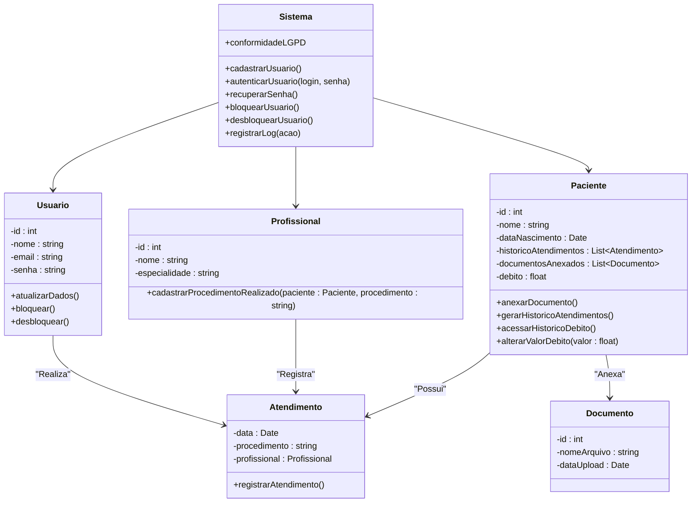
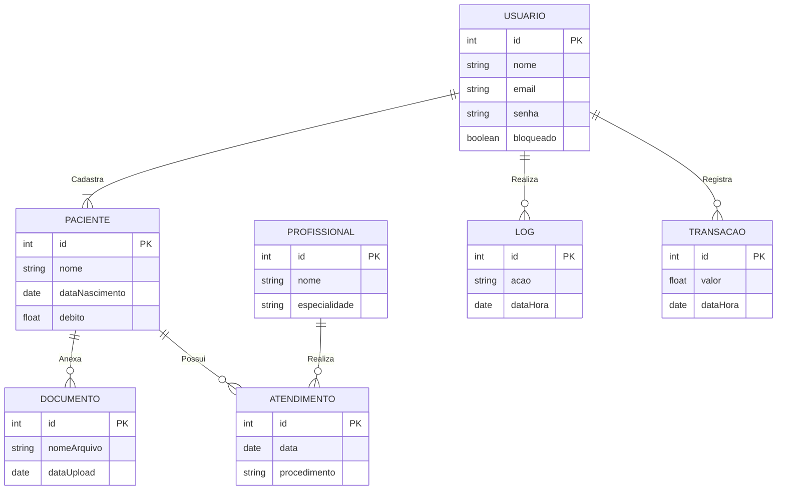
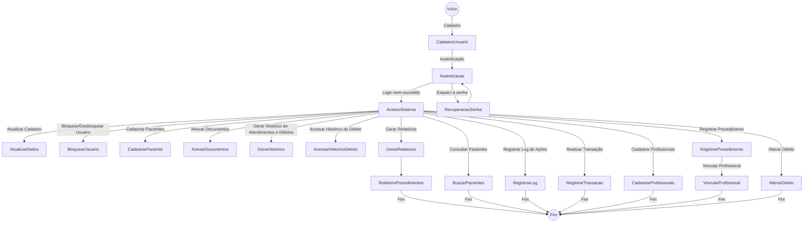
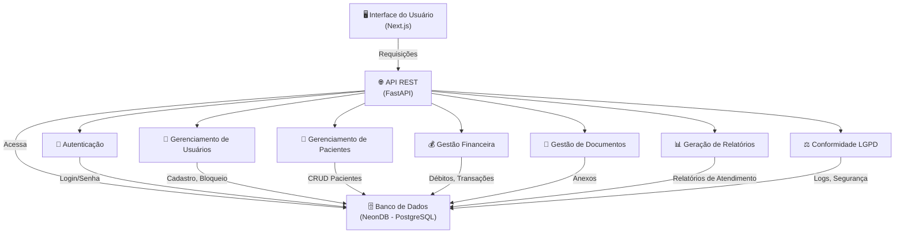
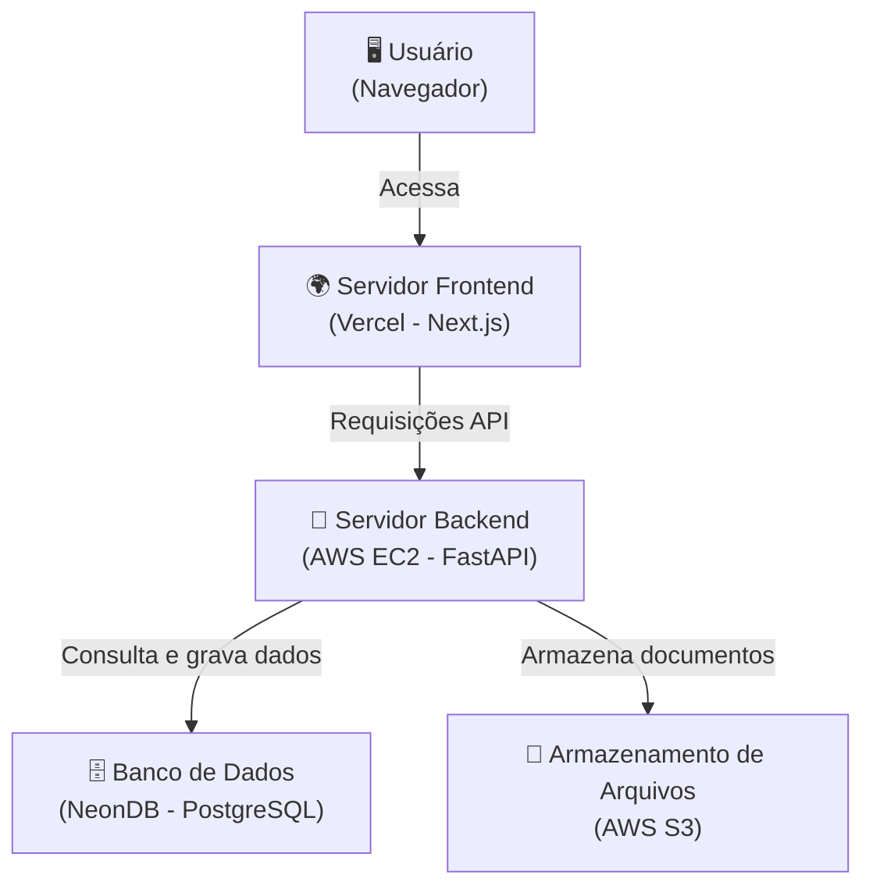
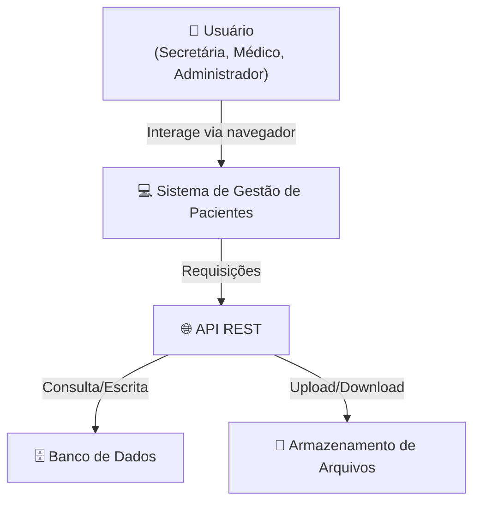
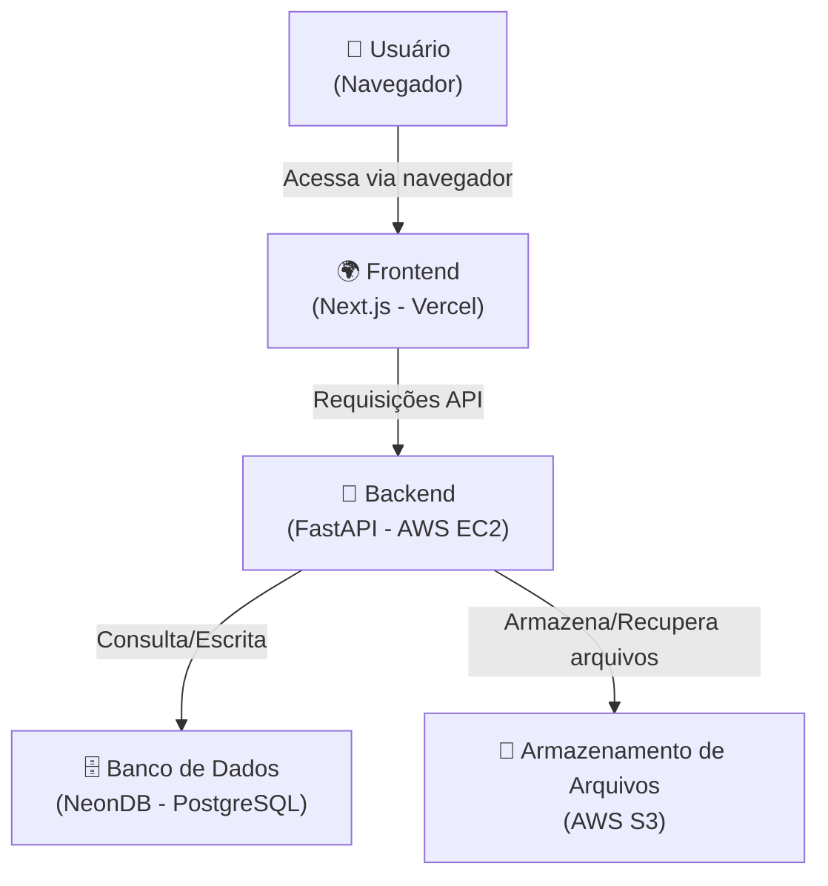
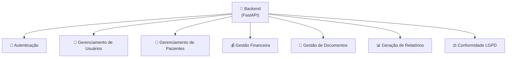
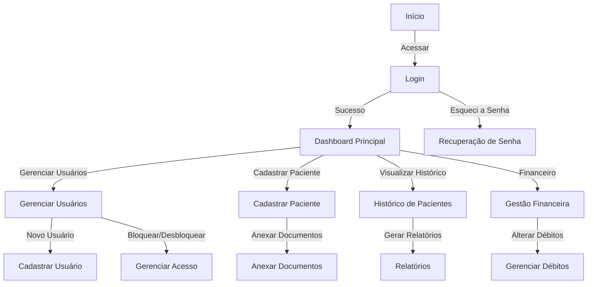

# Gestão de débitos e procedimentos
ENGENHARIA DE SOFTWARE 

# Sumário


- [Gestão de débitos e procedimentos](#gestão-de-débitos-e-procedimentos)
- [Sumário](#sumário)
  - [1. Introdução](#1-introdução)
  - [2. Descrição](#2-descrição)
    - [2.1. Requisitos](#21-requisitos)
    - [2.2. Funcionais e não funcionais](#22-funcionais-e-não-funcionais)
  - [3. Diagramas](#3-diagramas)
    - [3.1. Diagrama de classes](#31-diagrama-de-classes)
      - [Digrama no Whitestar](#digrama-no-whitestar)
      - [Diagrama gerado por IA](#diagrama-gerado-por-ia)
      - [**Explicação:**](#explicação)
    - [3.2. Diagrama ER](#32-diagrama-er)
      - [**Explicação das Entidades e Relacionamentos:**](#explicação-das-entidades-e-relacionamentos)
    - [3.2. Diagramas de casos de uso](#32-diagramas-de-casos-de-uso)
    - [3.3. diagrama de atividade](#33-diagrama-de-atividade)
      - [**Explicação do Diagrama:**](#explicação-do-diagrama)
    - [3.4. diagrama de componentes](#34-diagrama-de-componentes)
      - [**Explicação do Diagrama**:](#explicação-do-diagrama-1)
    - [3.5. diagrama de implantação](#35-diagrama-de-implantação)
      - [**Explicação do Diagrama**:](#explicação-do-diagrama-2)
      - [**Explicação do Diagrama**:](#explicação-do-diagrama-3)
    - [3.6. Diagramas C4](#36-diagramas-c4)
      - [3.6.1. Diagrama C4 de contexto](#361-diagrama-c4-de-contexto)
      - [3.6.2. Diagrama C4 de container](#362-diagrama-c4-de-container)
      - [3.6.3. Diagrama C4 de componente](#363-diagrama-c4-de-componente)
      - [3.6.4. Diagrama C4 de código](#364-diagrama-c4-de-código)
      - [**Explicação**:](#explicação-1)
  - [4. Hitórias de usuário](#4-hitórias-de-usuário)
    - [4.1. Organização de Épicos e Features](#41-organização-de-épicos-e-features)
      - [4.1.1. **Épico 1: Gestão de Usuários**](#411-épico-1-gestão-de-usuários)
      - [4.1.2. **Épico 2: Gestão de Pacientes**](#412-épico-2-gestão-de-pacientes)
      - [4.1.3. **Épico 3: Usabilidade e Interface**](#413-épico-3-usabilidade-e-interface)
      - [4.1.4. **Épico 4: Relatórios e Profissionais**](#414-épico-4-relatórios-e-profissionais)
    - [4.2. Jornada de Usuário](#42-jornada-de-usuário)
      - [4.2.1. Cadastro de Usuários](#421-cadastro-de-usuários)
      - [4.2.2. Autenticação (Login e Senha)](#422-autenticação-login-e-senha)
      - [4.2.3. Recuperação de Senha](#423-recuperação-de-senha)
      - [4.2.4. Cadastro de Pacientes](#424-cadastro-de-pacientes)
      - [4.2.5. Atualização de Dados Cadastrais](#425-atualização-de-dados-cadastrais)
      - [4.2.6. Histórico de Atendimentos e Débitos](#426-histórico-de-atendimentos-e-débitos)
      - [4.2.7. Interface Intuitiva e Responsiva](#427-interface-intuitiva-e-responsiva)
      - [4.2.8. Relatório de Procedimentos Realizados](#428-relatório-de-procedimentos-realizados)
      - [4.2.9. Cadastro de Profissionais](#429-cadastro-de-profissionais)
  - [5. Protótipo de telas](#5-protótipo-de-telas)
    - [5.1. Tela de login](#51-tela-de-login)
    - [5.2. Tela de recuperação de senha](#52-tela-de-recuperação-de-senha)
    - [5.3. Cadastro de paciente](#53-cadastro-de-paciente)
    - [5.4. Edição de paciente](#54-edição-de-paciente)
    - [5.5. Listagem e Busca de Pacientes](#55-listagem-e-busca-de-pacientes)
    - [5.6. Visualização do paciente](#56-visualização-do-paciente)
    - [5.7. Registro de Atendimento](#57-registro-de-atendimento)
    - [5.8. Cadastro de Profissional](#58-cadastro-de-profissional)
    - [5.9. Listagem de Profissionais](#59-listagem-de-profissionais)
    - [5.9. Listagem de Profissionais](#59-listagem-de-profissionais-1)
    - [5.10. Cadastro de débito](#510-cadastro-de-débito)
    - [5.11. Listagem de débito](#511-listagem-de-débito)
    - [5.12. Cadastro de usuário](#512-cadastro-de-usuário)
    - [5.13. Listagemm e gerenciamento de usuários](#513-listagemm-e-gerenciamento-de-usuários)
  - [6. Diagrama de navegação de telas](#6-diagrama-de-navegação-de-telas)
  - [7. Pilha tecnológica](#7-pilha-tecnológica)
    - [Linguagem Principal](#linguagem-principal)
    - [Framework de Interface (Desktop)](#framework-de-interface-desktop)
    - [Frontend](#frontend)
    - [Banco de Dados Local](#banco-de-dados-local)
    - [ORM](#orm)
    - [Autenticação](#autenticação)
    - [Empacotamento e Distribuição](#empacotamento-e-distribuição)
    - [Ferramentas Auxiliares](#ferramentas-auxiliares)
    - [Fluxo de Desenvolvimento](#fluxo-de-desenvolvimento)
  - [8. Cronograma, Gráfico de Gantt](#8-cronograma-gráfico-de-gantt)
  - [9. Estimativa de custos](#9-estimativa-de-custos)
  - [Anexos](#anexos)
    - [A.1. Script SQL](#a1-script-sql)
    - [A.2. Dados artificiais para testes de banco](#a2-dados-artificiais-para-testes-de-banco)


## 1. Introdução

Software para gerenciar débitos e procedimentos de clientes em uma clínica odontológica/estética.

## 2. Descrição

### 2.1. Requisitos

|id|Requisitos        |
|--|----------        |
|1| O sistema deve permitir cadastro de usuários
|2| Deve haver autenticação com login e senha
|3| Possibilitar recuperação de senha
|4| Permitir bloqueio e desbloqueio de usuários
|5| Registrar log de todas as ações dos usuários
|6| Cadastrar pacientes com informações completas
|7| Permitir atualização de dados cadastrais
|8| Gerar histórico de atendimentos e débitos
|9| Possibilitar anexar documentos ao cadastro
|10| Implementar busca e filtros de pacientes
|11| Alteração do valor do débito
|12| Conformidade com LGPD
|13| Registrar todas as transações
|14| Interface intuitiva e responsiva
|15| Relatório de procedimentos realizados
|16| Acessar o hitórico de débito e procedimentos de um cliente
|17| Vincular com o profissional o precedimentos feito pelo cliente
|18| Cadastrar profissionais

### 2.2. Funcionais e não funcionais

> [!Tip] 
> Faça uma tabela usando Markdown com duas colunas, uma coluna indicando o requisito e a outra coluna indicando o tipo de requisito ( como "funcional" ou "não funcional" ), para esta tarefa use a lista abaixo:

| Requisito                                                | Tipo de Requisito  |
|----------------------------------------------------------|--------------------|
| O sistema deve permitir cadastro de usuários              | Funcional          |
| Deve haver autenticação com login e senha                 | Funcional          |
| Possibilitar recuperação de senha                         | Funcional          |
| Permitir bloqueio e desbloqueio de usuários               | Funcional          |
| Registrar log de todas as ações dos usuários              | Funcional          |
| Cadastrar pacientes com informações completas             | Funcional          |
| Permitir atualização de dados cadastrais                  | Funcional          |
| Gerar histórico de atendimentos e débitos                 | Funcional          |
| Possibilitar anexar documentos ao cadastro                | Funcional          |
| Implementar busca e filtros de pacientes                  | Funcional          |
| Alteração do valor do débito                              | Funcional          |
| Conformidade com LGPD                                     | Não Funcional      |
| Registrar todas as transações                             | Funcional          |
| Interface intuitiva e responsiva                          | Não Funcional      |
| Relatório de procedimentos realizados                     | Funcional          |
| Acessar o histórico de débito e procedimentos de um cliente| Funcional          |
| Vincular com o profissional o procedimento feito pelo cliente | Funcional       |
| Cadastrar profissionais                                   | Funcional          |
| Banco de dados postgree                                   | Não funcional      |
| Design Responsivo                                         | Não funcional      |  

[Voltar ao início](#sumário)
## 3. Diagramas

### 3.1. Diagrama de classes

#### Digrama no Whitestar


#### Diagrama gerado por IA

> [!tip]
> Faça um diagrama de classe usando Markdown e Mermaid, para os requisitos abaixo:



#### **Explicação:**
- **Sistema**: Classe principal que lida com funcionalidades gerais, como cadastro e autenticação de usuários, além de conformidade com LGPD e registro de logs.
- **Usuario**: Classe que representa usuários do sistema, com métodos para atualizar dados e bloquear/desbloquear.
- **Paciente**: Classe que armazena informações sobre pacientes e inclui funcionalidades como anexar documentos, gerar histórico de atendimentos, acessar histórico de débito, e alterar valores de débito.
- **Profissional**: Classe que armazena informações de profissionais e vincula procedimentos realizados aos pacientes.
- **Atendimento**: Classe que registra um atendimento realizado, incluindo data, procedimento e profissional que o realizou.
- **Documento**: Classe que representa documentos anexados ao cadastro do paciente.

Esse diagrama reflete os requisitos funcionais do sistema e mostra como as classes e seus métodos podem interagir.

[Voltar ao início](#sumário)


### 3.2. Diagrama ER

>[!tip]
Faça um diagrama de Entidade Relacionamento usando o Markdown e Mermaid, para os requisitos abaixo:



#### **Explicação das Entidades e Relacionamentos:**
- **USUARIO**: Representa os usuários cadastrados no sistema, com atributos básicos (id, nome, email, senha, status de bloqueio). Relaciona-se com LOG, PACIENTE e TRANSACAO.
  - Relacionamento com LOG: "Realiza" ações registradas no log.
  - Relacionamento com PACIENTE: "Cadastra" pacientes no sistema.
  - Relacionamento com TRANSACAO: "Registra" transações realizadas no sistema.
  
- **PACIENTE**: Entidade que armazena informações dos pacientes, como nome, data de nascimento e débito. Relaciona-se com DOCUMENTO e ATENDIMENTO.
  - Relacionamento com DOCUMENTO: "Anexa" documentos ao cadastro.
  - Relacionamento com ATENDIMENTO: "Possui" histórico de atendimentos.

- **PROFISSIONAL**: Representa profissionais que realizam procedimentos médicos. Relaciona-se com ATENDIMENTO.
  - Relacionamento com ATENDIMENTO: "Realiza" procedimentos médicos vinculados ao paciente.

- **ATENDIMENTO**: Registra os atendimentos realizados, incluindo data e o procedimento.

- **DOCUMENTO**: Entidade para armazenar documentos anexados ao cadastro do paciente.

- **LOG**: Armazena registros de ações realizadas pelos usuários.

- **TRANSACAO**: Entidade para registrar as transações financeiras associadas a débitos.

Esse diagrama reflete os principais relacionamentos e entidades do sistema, ajudando a visualizar a modelagem do banco de dados com base nos requisitos fornecidos.

[Voltar ao início](#sumário)

### 3.2. Diagramas de casos de uso


>[!tip]
>Faça um diagrama de casos de uso usando Markdown e PlantUML, para os requisitos abaixo:


### 3.3. diagrama de atividade


>[!tip]
>Faça um diagrama de atividade usando Markdown e Mermaid, para os requisitos abaixo:



---
#### **Explicação do Diagrama:**
1. O **usuário** pode iniciar o fluxo cadastrando-se no sistema.
2. O usuário realiza a **autenticação** para acessar o sistema.
3. Caso esqueça a senha, pode seguir o fluxo de **recuperação**.
4. Uma vez autenticado, pode realizar diversas ações:
   - Atualizar seus dados.
   - Bloquear/desbloquear usuários.
   - Registrar logs de ações.
   - Cadastrar pacientes e profissionais.
   - Anexar documentos.
   - Buscar pacientes e aplicar filtros.
   - Alterar débitos e acessar histórico financeiro.
   - Registrar e vincular procedimentos a profissionais.
   - Gerar relatórios de procedimentos.
5. O fluxo se encerra após cada funcionalidade ser concluída.

Isso representa um **panorama geral** do sistema com base nos requisitos.


### 3.4. diagrama de componentes

> [!tip]
> Faça um diagrama de componentes usando Markdown e Mermaid, para os requisitos abaixo:




---

#### **Explicação do Diagrama**:
1. **Camada de Interface**:  
   - **`Interface do Usuário (Next.js)`**: A aplicação frontend onde os usuários interagem.  
   - Comunica-se com a API para realizar operações como login, cadastro, busca de pacientes, etc.

2. **Camada de API**:  
   - **`API REST (FastAPI)`**: Intermediário entre o frontend e o banco de dados.  
   - Processa requisições e redireciona para os componentes responsáveis.

3. **Camada de Componentes**:  
   - **`Autenticação`**: Responsável pelo login, logout e recuperação de senha.  
   - **`Gerenciamento de Usuários`**: Cadastro, bloqueio e desbloqueio.  
   - **`Gerenciamento de Pacientes`**: CRUD de pacientes e histórico de atendimento.  
   - **`Gestão Financeira`**: Controle de débitos e transações financeiras.  
   - **`Gestão de Documentos`**: Upload e gerenciamento de arquivos anexos.  
   - **`Geração de Relatórios`**: Criação de relatórios detalhados.  
   - **`Conformidade LGPD`**: Registro de logs e proteção de dados.

4. **Camada de Banco de Dados**:  
   - **`PostgreSQL (NeonDB)`**: Armazena todas as informações do sistema.

---

Esse diagrama mostra a **arquitetura baseada em componentes** e como cada parte do sistema interage.

[Voltar ao início](#sumário)


### 3.5. diagrama de implantação



---

#### **Explicação do Diagrama**:
#### **Explicação do Diagrama**:
1. **Usuário**:  
   - Acessa a aplicação via **navegador**.

2. **Servidor Frontend** (Next.js - Vercel):  
   - Responsável por renderizar a interface e encaminhar requisições para a API.

3. **Servidor Backend** (FastAPI - AWS EC2):  
   - Processa as requisições e executa regras de negócio.

4. **Banco de Dados** (NeonDB - PostgreSQL):  
   - Armazena usuários, pacientes, históricos, transações, etc.

5. **Armazenamento de Arquivos** (AWS S3):  
   - Guarda documentos anexados.

---

Esse diagrama mostra **como os componentes do sistema são implantados na infraestrutura**. 

[Voltar ao início](#sumário)


### 3.6. Diagramas C4
#### 3.6.1. Diagrama C4 de contexto

#### 3.6.2. Diagrama C4 de container

#### 3.6.3. Diagrama C4 de componente

#### 3.6.4. Diagrama C4 de código

---

#### **Explicação**:

- O **diagrama de contexto** mostra a visão geral do sistema.
- O **diagrama de container** detalha os principais módulos do sistema.
- O **diagrama de componentes** descreve a organização interna do backend.

[Voltar ao início](#sumário)

## 4. Hitórias de usuário

### 4.1. Organização de Épicos e Features

#### 4.1.1. **Épico 1: Gestão de Usuários**
- Feature: Cadastro de usuários
- Feature: Autenticação (login e senha)
- Feature: Recuperação de senha

#### 4.1.2. **Épico 2: Gestão de Pacientes**
- Feature: Cadastro de pacientes
- Feature: Atualização de dados cadastrais
- Feature: Acesso ao histórico de atendimentos e débitos

#### 4.1.3. **Épico 3: Usabilidade e Interface**
- Feature: Interface intuitiva e responsiva

#### 4.1.4. **Épico 4: Relatórios e Profissionais**
- Feature: Relatório de procedimentos realizados
- Feature: Cadastro de profissionais

### 4.2. Jornada de Usuário

#### 4.2.1. Cadastro de Usuários  
**Como administrador**, eu quero cadastrar novos usuários no sistema para que eles possam acessá-lo e utilizar suas funcionalidades.

#### 4.2.2. Autenticação (Login e Senha)  
**Como usuário**, eu quero fazer login no sistema utilizando e-mail e senha para que eu possa acessar minhas informações e funcionalidades disponíveis.

#### 4.2.3. Recuperação de Senha  
**Como usuário**, eu quero poder recuperar minha senha caso eu a esqueça para que eu possa continuar acessando o sistema sem precisar de suporte técnico.

#### 4.2.4. Cadastro de Pacientes  
**Como recepcionista**, eu quero cadastrar pacientes com informações completas para que os profissionais possam acessá-las durante os atendimentos.

#### 4.2.5. Atualização de Dados Cadastrais  
**Como usuário autorizado**, eu quero atualizar os dados cadastrais dos pacientes para que as informações estejam sempre corretas e atualizadas.

#### 4.2.6. Histórico de Atendimentos e Débitos  
**Como profissional de saúde**, eu quero acessar o histórico de atendimentos e débitos de um paciente para que eu possa ter um acompanhamento completo do seu tratamento.

#### 4.2.7. Interface Intuitiva e Responsiva  
**Como usuário**, eu quero que a interface do sistema seja intuitiva e responsiva para que eu possa utilizá-la com facilidade em diferentes dispositivos.

#### 4.2.8. Relatório de Procedimentos Realizados  
**Como profissional de saúde**, eu quero gerar relatórios dos procedimentos realizados para que eu possa acompanhar e analisar os atendimentos feitos.

#### 4.2.9. Cadastro de Profissionais  
**Como administrador**, eu quero cadastrar profissionais no sistema para que eles possam ser associados aos procedimentos e pacientes atendidos.


[Voltar ao início](#sumário)


## 5. Protótipo de telas
### 5.1. Tela de login


### 5.2. Tela de recuperação de senha


### 5.3. Cadastro de paciente


### 5.4. Edição de paciente


### 5.5. Listagem e Busca de Pacientes


### 5.6. Visualização do paciente


### 5.7. Registro de Atendimento


### 5.8. Cadastro de Profissional


### 5.9. Listagem de Profissionais


### 5.9. Listagem de Profissionais


### 5.10. Cadastro de débito


### 5.11. Listagem de débito


### 5.12. Cadastro de usuário


### 5.13. Listagemm e gerenciamento de usuários


## 6. Diagrama de navegação de telas


---


[Voltar ao início](#sumário)


## 7. Pilha tecnológica

### Linguagem Principal
- **TypeScript**: Linguagem com tipagem forte, utilizada tanto no front-end quanto no back-end local.

### Framework de Interface (Desktop)
- **Tauri**: Framework leve e seguro para desenvolvimento de aplicações desktop multiplataforma (Windows, macOS, Linux). Utiliza webview e integra com código em Rust.
- **Alternativas**:
  - Electron (mais maduro, porém mais pesado)
  - Flutter (caso deseje o mesmo código para desktop e mobile)

### Frontend
- **React**: Biblioteca moderna para criação de interfaces reativas.
- **Vite**: Empacotador de módulos rápido e moderno.
- **Tailwind CSS**: Framework utilitário para criação de interfaces com design consistente e responsivo.

### Banco de Dados Local
- **SQLite**: Banco de dados relacional leve, ideal para aplicações locais e offline.
- Armazenamento de dados diretamente em disco, sem necessidade de servidor de banco.

### ORM
- **Drizzle ORM** ou **Prisma**: ORMs modernos com suporte a TypeScript e integração com SQLite.
- Facilita a manipulação de dados com segurança e produtividade.

### Autenticação
- Autenticação local com login e senha utilizando:
  - Hash de senha com `bcrypt`
  - Tokens locais (`JWT` ou equivalente)
  - Armazenamento seguro em banco de dados local

### Empacotamento e Distribuição
- **Tauri Build**: Geração de instaladores para Windows (.exe), macOS (.dmg) e Linux (.AppImage), com tamanho reduzido e boa performance.

### Ferramentas Auxiliares
- **Figma**: Ferramenta para prototipação de interfaces.
- **Storybook** (opcional): Documentação visual e desenvolvimento de componentes isolados.

### Fluxo de Desenvolvimento
1. Interface construída com React, Vite e Tailwind.
2. Banco de dados local SQLite acessado via ORM.
3. Lógica e persistência implementadas em TypeScript.
4. Aplicação empacotada com Tauri para execução local.


## 8. Cronograma, Gráfico de Gantt


## 9. Estimativa de custos

>Total: </br>
>R$ 158.877,60 para 6 meses

## Anexos

### A.1. Script SQL

> [!tip]
> Faça um Script SQL para MySQL, para o diagrama Mermaid acima:

```SQL

-- Criação da tabela de Usuários
CREATE TABLE Usuario (
    id INT AUTO_INCREMENT PRIMARY KEY,
    nome VARCHAR(100) NOT NULL,
    email VARCHAR(100) NOT NULL UNIQUE,
    senha VARCHAR(255) NOT NULL,
    bloqueado BOOLEAN DEFAULT FALSE
);

-- Criação da tabela de Pacientes
CREATE TABLE Paciente (
    id INT AUTO_INCREMENT PRIMARY KEY,
    nome VARCHAR(100) NOT NULL,
    dataNascimento DATE NOT NULL,
    debito DECIMAL(10, 2) DEFAULT 0.00
);

-- Criação da tabela de Profissionais
CREATE TABLE Profissional (
    id INT AUTO_INCREMENT PRIMARY KEY,
    nome VARCHAR(100) NOT NULL,
    especialidade VARCHAR(100)
);

-- Criação da tabela de Atendimentos
CREATE TABLE Atendimento (
    id INT AUTO_INCREMENT PRIMARY KEY,
    data DATE NOT NULL,
    procedimento VARCHAR(100) NOT NULL,
    paciente_id INT NOT NULL,
    profissional_id INT NOT NULL,
    FOREIGN KEY (paciente_id) REFERENCES Paciente(id) ON DELETE CASCADE,
    FOREIGN KEY (profissional_id) REFERENCES Profissional(id) ON DELETE CASCADE
);

-- Criação da tabela de Documentos
CREATE TABLE Documento (
    id INT AUTO_INCREMENT PRIMARY KEY,
    nomeArquivo VARCHAR(255) NOT NULL,
    dataUpload DATE NOT NULL,
    paciente_id INT NOT NULL,
    FOREIGN KEY (paciente_id) REFERENCES Paciente(id) ON DELETE CASCADE
);

-- Criação da tabela de Logs
CREATE TABLE Log (
    id INT AUTO_INCREMENT PRIMARY KEY,
    acao VARCHAR(255) NOT NULL,
    dataHora TIMESTAMP DEFAULT CURRENT_TIMESTAMP,
    usuario_id INT NOT NULL,
    FOREIGN KEY (usuario_id) REFERENCES Usuario(id) ON DELETE CASCADE
);

-- Criação da tabela de Transações
CREATE TABLE Transacao (
    id INT AUTO_INCREMENT PRIMARY KEY,
    valor DECIMAL(10, 2) NOT NULL,
    dataHora TIMESTAMP DEFAULT CURRENT_TIMESTAMP,
    usuario_id INT NOT NULL,
    FOREIGN KEY (usuario_id) REFERENCES Usuario(id) ON DELETE CASCADE
);
```
### A.2. Dados artificiais para testes de banco

>[!tip]
> Faça um Script para MySQL, usando os comandos Create Table anteriores, para popular as tabelas do banco com pelo menos % registros fictícios

```SQL
-- Populando a tabela Usuario
INSERT INTO Usuario (nome, email, senha, bloqueado)
VALUES 
('João Silva', 'joao@email.com', 'senha123', FALSE),
('Maria Santos', 'maria@email.com', 'senha456', FALSE),
('Carlos Oliveira', 'carlos@email.com', 'senha789', TRUE),
('Ana Souza', 'ana@email.com', 'senhaabc', FALSE),
('Pedro Costa', 'pedro@email.com', 'senhadef', TRUE);

-- Populando a tabela Paciente
INSERT INTO Paciente (nome, dataNascimento, debito)
VALUES 
('Lucas Mendes', '1990-04-15', 150.75),
('Fernanda Lima', '1985-09-10', 0.00),
('Gabriel Costa', '2000-12-01', 300.00),
('Isabela Duarte', '1995-07-21', 50.50),
('Ricardo Almeida', '1988-03-05', 75.00);

-- Populando a tabela Profissional
INSERT INTO Profissional (nome, especialidade)
VALUES 
('Dr. Marcos Pereira', 'Cardiologista'),
('Dra. Juliana Figueiredo', 'Dermatologista'),
('Dr. Roberto Nunes', 'Ortopedista'),
('Dra. Camila Fernandes', 'Neurologista'),
('Dr. Eduardo Ramos', 'Pediatra');

-- Populando a tabela Atendimento
INSERT INTO Atendimento (data, procedimento, paciente_id, profissional_id)
VALUES 
('2025-03-20', 'Consulta de rotina', 1, 1),
('2025-03-18', 'Exame dermatológico', 2, 2),
('2025-03-15', 'Tratamento ortopédico', 3, 3),
('2025-03-10', 'Avaliação neurológica', 4, 4),
('2025-03-05', 'Consulta pediátrica', 5, 5);

-- Populando a tabela Documento
INSERT INTO Documento (nomeArquivo, dataUpload, paciente_id)
VALUES 
('exame_sangue.pdf', '2025-03-01', 1),
('raio_x_torax.png', '2025-02-28', 2),
('relatorio_ortopedico.docx', '2025-03-03', 3),
('laudo_neurologico.pdf', '2025-03-07', 4),
('ficha_pediatrica.xlsx', '2025-03-09', 5);

-- Populando a tabela Log
INSERT INTO Log (acao, usuario_id)
VALUES 
('Usuário realizou login', 1),
('Usuário cadastrou um paciente', 2),
('Usuário bloqueou outro usuário', 3),
('Usuário atualizou informações de um paciente', 4),
('Usuário registrou um log', 5);

-- Populando a tabela Transacao
INSERT INTO Transacao (valor, usuario_id)
VALUES 
(150.75, 1),
(300.00, 2),
(50.50, 3),
(75.00, 4),
(200.00, 5);

```
